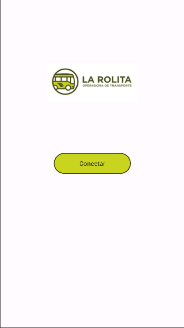

# Android Sensor and Location Tracker

## Descripción

Este proyecto de Android tiene como objetivo recopilar y almacenar datos de varios sensores del dispositivo, como el acelerómetro, el giroscopio, el sensor de gravedad y el campo magnético. Además, también rastrea la ubicación del dispositivo utilizando el GPS. Todos los datos recopilados se almacenan en un archivo en el almacenamiento del dispositivo para su posterior análisis.

## Características

- **Recopila datos del acelerómetro, giroscopio, sensor de gravedad y campo magnético.**
- **Rastrea la ubicación del dispositivo en tiempo real.**
- **Almacena todos los datos recopilados en un archivo.**
- **Funciona en segundo plano utilizando un servicio en primer plano para asegurar la recopilación continua de datos.**

## Requisitos

- Android 6.0 (API nivel 23) o superior.
- Permisos para acceder a la ubicación y al almacenamiento del dispositivo.

## Uso

1. Clone el repositorio.
2. Abra el proyecto en Android Studio.
3. Asegúrese de conceder los permisos necesarios cuando se le solicite.
4. Ejecute la aplicación en un dispositivo Android real o en un emulador con las API de Google Play Services instaladas.

